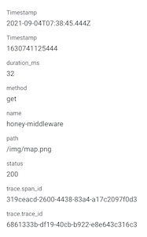
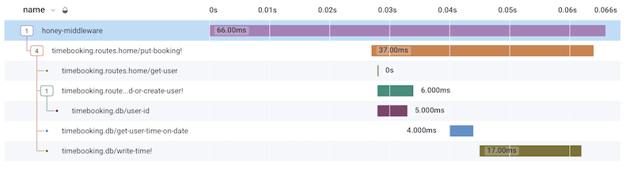

# Maja

A small Clojure library to wrap the libhoney-java client used to transit events to Honeycomb.

## Purpose

We realized we wrote the same code in several applications to integrate honeycomb.io into our application. This library was extracted for internal use, so we decided to publish it. It might be very opinionated and tailored to our usecases.

## Creating a client 
The following code creates a new instance of the Honeycomb Java Client:

``` clojure
(require '[maja.core :refer [initialize-honey])

(initialize-honey {:write-key "xxxxxxx"
                   :dataset "my-ds-name"
                   :sample-rate 1})
```

It is not Majas job to store the reference, your applications lifefycle needs to take care of this!

## Honey Middleware
The library contains a middleware which starts a trace for all incoming HTTP requests. Subsequent spans will be added to that trace, too.

```clojure
(require '[maja.core :refer [initialize-honey]
          [maja.middleware :refer [wrap-honey-middleware]]])

(def honey initialize-honey {:write-key "xxxxxxx"
                            :dataset "my-ds-name"
                            :sample-rate 1})

(defn wrap-honey-middleware [handler]
  (if (some? honey)
    (honey-middleware handler honey)
    handler))
```

It automatically traces the following fields:

| Field | Description  | 
|---|---|
|Timestamp   | Timestamp of the HTTP call | 
|duration_ms | Duration it took to process the HTTP call | 
|method | The HTTP method (get, post, put...), lowercase  | 
|name | Defaults to "honey-middleware"| 
|path| The HTTP path of the request |
|status| The HTTP status of the request|
|trace.span_id| A unique UUID|
|trace.trace_id| A UUID, shared with subsequent spans|



## Adding to a trace manually
The parent trace_id and span_id are managed with scoping in the library. When a trace was started (e.g. by the middleware), you can call `send-in-trace` to "manually" add a trace with your desired fields to it: 

``` clojure
(require '[maja.core :refer [send-in-trace]])

(send-in-trace {"name" "mail-rate-limit-hit"
                "error" true}
                 honey-client)
```

This event will be present in the whole trace and gets timestamped automatically.


## "Auto" tracing
Adding traces (and more nested spans) manually can show intent in the code, but it can also clutter and be repetitive. For this reason, Maja enables you to automatically trace Clojure functions with adding `{:traced true}` to their metadata. To enable this feature, you need to call the function `wrap-all-trace-methods` in the `maja.core` namespace. This function will scan all of your namespaces for functions with the correct metadata, and wrap them in a trace function using `alter-var-root`. Each call to these functions will create a new span in the active trace (or a new trace, if none is present), creating a hierarchy of your nested function calls with timestamps and duration of each function. This will integrate with traces started by the honey-middleware.



``` clojure
; Example for a traced Clojure function (which is present in the screenshot above)
(defn load-or-create-user! {:traced true} [email]
  (:id
   (or (db/user-id {:email email})
       (conman/with-transaction [db/*db*]
         (db/create-user! {:id (.toString (java.util.UUID/randomUUID))
                           :email email})
         (db/user-id {:email email})))))
         
; Call this once upon intialization
(wrap-all-trace-methods honey-client)
```


## License

Copyright © 2021 lambdaschmiede GmbH

This program and the accompanying materials are made available under the
terms of the Eclipse Public License 2.0 which is available at
http://www.eclipse.org/legal/epl-2.0.

This Source Code may also be made available under the following Secondary
Licenses when the conditions for such availability set forth in the Eclipse
Public License, v. 2.0 are satisfied: GNU General Public License as published by
the Free Software Foundation, either version 2 of the License, or (at your
option) any later version, with the GNU Classpath Exception which is available
at https://www.gnu.org/software/classpath/license.html.
